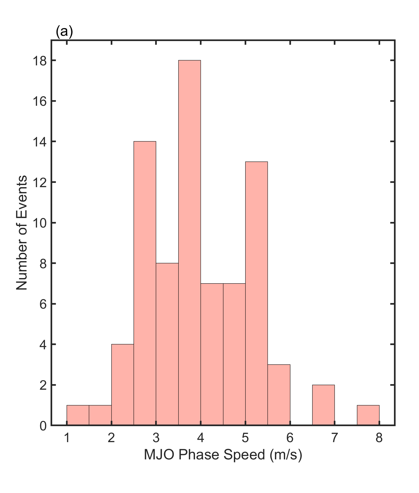

# MJO-tracking

A modular MATLAB toolkit for identifying, tracking, and compositing Madden–Julian Oscillation (MJO) events using daily OLR data.  This repository provides a clean workflow from preprocessing to event detection, propagation-speed estimation, and composite analysis.

#### Method adapted from: 
#### Jian Ling et al., "Global versus Local MJO Forecast Skill of the ECMWF Model during DYNAMO," <i>Monthly Weather Review</i>, 2014.
#### Chen and Wang, "Circulation Factors Determining the Propagation Speed of the Madden–Julian Oscillation," <i>Journal of Climate</i>, 2020.

---

## Folder Structure

```
src/
│
├── preprocess_olr.m              # Preprocess OLR: trim years, remove leap days, save new NetCDF
├── compute_equatorial_olr.m      # Compute ±5° / ±10° equatorial mean OLR
├── build_mjo_segments.m          # Build Hovmöller slices and identify t0 (MJO minima)
├── track_mjo_all_years.m         # **CORE ALGORITHM**: fit propagation lines & compute MJO phase speeds
│
├── classify_mjo_speed.m          # Classify events into slow / fast groups
├── composite_olr.m               # Compute OLR composites (±30 days)
├── ttest_composite.m             # Student-t significance testing for composites
│
├── plot_phase_speed_hist.m       # Histogram of MJO phase speeds
└── plot_mjo_hovmoller.m          # WK99-style longitude–time composite plotting
```
---

## Requirements

- MATLAB R2020a or later  
- NetCDF support (built-in for modern MATLAB)

---

## Input Data Format

The raw dataset should be a daily OLR NetCDF file, typically from NOAA:

```
olr(lat, lon, time)
lat(lat)
lon(lon)
time(time)      
```

Place your raw file under:

```
data/raw/
```
---

## Typical Workflow

Below is a minimal example showing how to run the full pipeline:

```
% MJO-tracking workflow

% 1. Preprocess OLR (remove leap days, extract 1979–2013)
preprocess_olr('data/raw/olr.day.mean.nc', ...
               'data/processed/olr_1979_2013.nc', ...
               1979, 2013);

% 2. Equatorial OLR and segments
[olr_EQ, time, lon] = compute_equatorial_olr('data/processed/olr_1979_2013.nc');
Seg                 = build_mjo_segments(olr_EQ, time, lon);

% 3. Track MJO and classify speeds
data_all = track_mjo_all_years(Seg, 1:0.1:25, 90);
[data_all, data_fast, data_slow] = classify_mjo_speed( ...
    'PropagationInfo.xlsx', ...
    'PropagationInfo_all.xlsx', ...
    'PropagationInfo_fast.xlsx', ...
    'PropagationInfo_slow.xlsx');

% 4. Composites + significance
[AllComp, FastComp, SlowComp] = composite_olr(time, olr_EQ, ...
    data_all, data_fast, data_slow, 30);
[t_fast, t_slow] = ttest_composite(FastComp, SlowComp);

% 5. Plot
plot_phase_speed_hist(data_all(:, 4));                 
plot_mjo_hovmoller(FastComp, SlowComp, t_fast, t_slow, lon);
```

---

## Example Results

### (a) Distribution of MJO Phase Speeds

<p align="center">
  <br>
  <em>Fig. 1(a). Histogram of phase speeds for the 79 eastward-propagating MJO events over the Indian Ocean.</em>
</p> 

---

### (b) Fast vs Slow MJO Composite Hovmöller Diagrams

<p align="center">
  <br>
  <em>
  Fig. 1(b–c). Composite Hovmöller diagrams of OLR anomalies (contours; W m<sup>−2</sup>) averaged over 10°S–10°N
  for fast and slow MJO events. The contour interval is 5 W m<sup>−2</sup>.
  Shaded regions are statistically significant at the 95% confidence level.
  </em>
</p>


## Output

The pipeline produces:

- Estimated MJO propagation speeds (m/s)  
- Classification of fast vs slow events  
- Composite OLR fields (fast / slow)  
- Significance masks (t-test)  
- Figures including:
  - Phase-speed histogram   
  - Hovmöller diagrams  

Figures can be stored under:

```
figures/
```

---

## License

MIT License.
